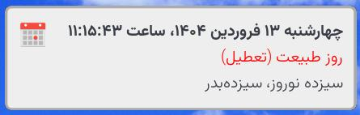
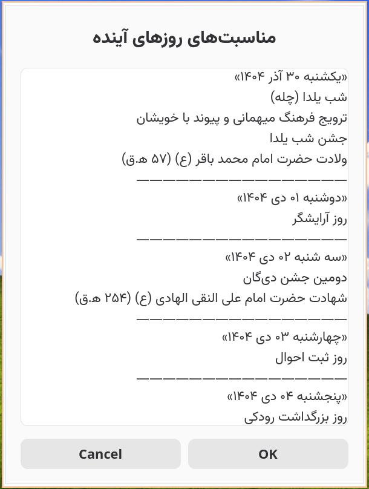

# imroo
A simple script to show Iranian calendar events for today or next days

## Dependencies
- [jdate](https://github.com/persiancal/jcal) : Iranian/Persian/Jalali/Shamsi date
- [idate](https://tracker.debian.org/pkg/itools) : Hijri date
- date : (GNU) Gregorian date
- curl
- jq

In a Debian-like distro:

```bash
sudo apt install curl jq itools
# jdate needs to be manually built from master, the one in Debian 13 is buggy
# https://github.com/persiancal/jcal
```

# Usage
Check `imroo -h`:

```console
$ imroo -h
imroo: shows Iranian/international calendar events for current day or
            future days

Usage: imroo [OPTIONS]
Options:
    -s       Sync database by downloading the json file from internet
    -d NUM   Number of days into future from today (including today)
    -j       Use JSON as output format
    -V       Print script version
    -h       Display the help message

Examples:
    # sync before first use
    imroo -s
    # get events for current day
    imroo
    # get events for today, tomorrow, and the day after tomorrow
    imroo -d3
```

- As another example, the script can be used with
[dunst](https://dunst-project.org/documentation/#COLORS) implementation of
`notify-send` like this:

```sh
#!/bin/sh

notify-send -i "calendar" \
    "$(jdate +%E | cut -d- -f1)" \
    "$(imroo -d1 \
    | awk '/تعطیل/{print "<span fgcolor=\"red\">" $0 "</span>"; next} {print}')"
```

<p align="center">
  
</p>

- The output string would be in UTF-8 Persian characters. Use terminal emulators
  that support RTL like [Konsole](https://konsole.kde.org/) to test the
  script. If the script is piped into GUI apps, it is expected that they render
  the output correctly. For example using
  [zenity](https://help.gnome.org/users/zenity/stable/):
  

```bash
zenity --width=600 --height=800 --title="مناسبت‌های روزهای آینده" \
       --text-info --filename=<(imroo -d 10)
```

<p align="center">
  
</p>

# Known issues
- For some days, the Hijri/Ghamari date, as calculated by `idate`, differs from
  what Iranian calendars consider to be the correct Hijri/Ghamari date. Hence,
  some Hijri events **may** have an off-by-one error for their date. Possibly
  [related issue
  here](https://github.com/persian-calendar/persian-calendar/issues/53).
  
  Here is a problematic case: 22 dec 2025 is considered to be the 1st of Rajab
  according to [time.ir](https://www.time.ir/), but `idate` (from Debian 13)
  calculates it to the 2nd of Rajab.
  
```console
$ idate --gregorian 20251222
Date Format (dd/mm/yyyy):
+ Input    : 22/12/2025      -     Monday(Mon) -     December(Dec)
-----------------------------
+ Output   :  2/ 7/1447 A.H  -    Ithnain(Ith) -        Rajab(Raj)
```

# Development
- linter: `shellcheck`
- formatter: `shfmt -i 4 -bn -ci -sr`
